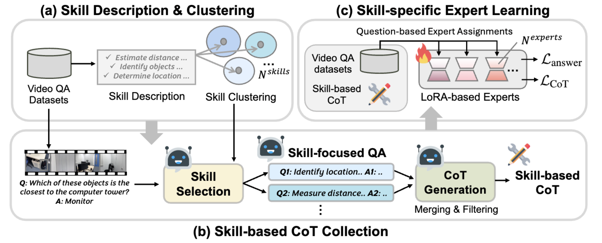

# 🛠️ Video-Skill-CoT: Skill-based Chain-of-Thoughts for Domain-Adaptive Video Reasoning

[](https://video-skill-cot.github.io/)  [](https://arxiv.org/pdf/2506.03525)   

#### [Daeun Lee*](https://daeunni.github.io/), [Jaehong Yoon*](https://jaehong31.github.io/), [Jaemin Cho](https://j-min.io), [Mohit Bansal](https://www.cs.unc.edu/~mbansal/)    


<br>

<br>

> 📌 **`TL;DR`** Video-Skill-CoT is a skill-aware CoT reasoning framework that constructs **domain-specific multi-step rationales** and trains expert modules for adaptive video understanding. 
   

## 🔧 Setup

<!-- ### Environment Setup 
You can install all packages from ```requirements.txt```. 
```shell
conda create -n videorepair python==3.10
conda activate videorepair
pip install -r requirements.txt 
```
Additionally, for Semantic-SAM, you should install detectron2 like below: 
```shell 
python -m pip install 'git+https://github.com/MaureenZOU/detectron2-xyz.git'
``` -->

### OpenAI/Gemini API Setup 
Our Video-Skill-CoT is based on openai/gemini api, so you need to setup your Azure OpenAI/Gemini API config in the below files. 
You can set your own API infomation in `./skill_cot_generation/config.ini`. 

```python
[openai]
azure_endpoint = your endpoint   
api_key = your key 
api_version = your version 
[gemini]
gemini_api_key = your gemini_api_key
gemini_application_credentials = your credentials 
```

### Download datasets 
Please locate all downloaded datasets in the  `./video_instruction_datasets` directory. The data structure will like below: 
```bash
./video_instruction_datasets
    ├── cinepile
    ├── ET_164k
    ├── VSI-Bench
```

## 🔩 Skill-CoT Generation 
Based on above video understanding datasets, you can generate skill-cot as follows: 
```bash
# [Step 1] Skill clustering 
python ./skill_cot_generation/clustering.py --dataset='cine'  

# [Step 2] Skill-CoT generation 
python ./skill_cot_generation/skill_cot_generation.py --dataset='cine' --mode='skill_cot'  

# [Step 3] Skill-CoT filtering   
python ./skill_cot_generation/filtering.py --dataset='cine'  
```

<!-- ## 🚃 LLaVA Video Training  -->


## 📝 TODO List
- [ ] Release Multi-LoRA training code 


## 📚 BibTeX

💗 If you enjoy our Video-Skill-CoT and find some beneficial things, citing our paper would be the best support for us! 

```
@article{lee2025videoskillcot,
  title={Video-Skill-CoT: Skill-based Chain-of-Thoughts for Domain-Adaptive Video Reasoning},
  author={Lee, Daeun and Yoon, Jaehong and Cho, Jaemin and Bansal, Mohit},
  journal={arXiv preprint arXiv:2506.03525},
  year={2025}
}
```


